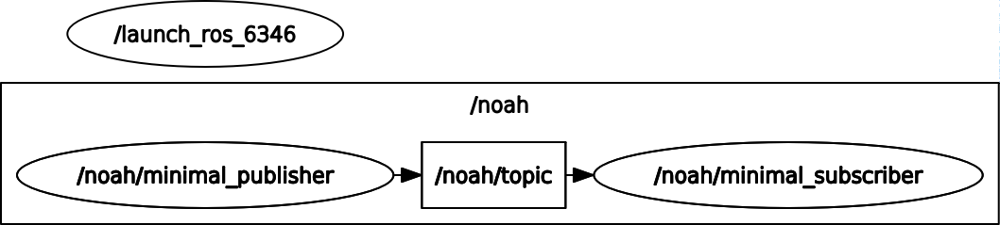
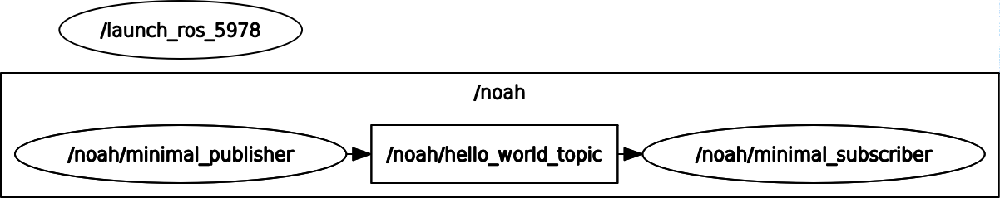
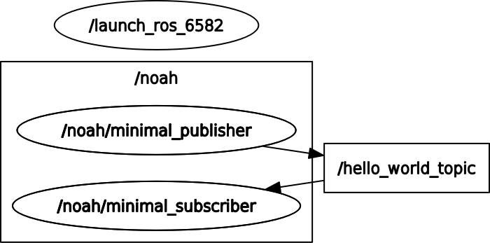

# CeCar Node-Configuration

[[_TOC_]]

## Basic ROS2 Concept

The basic elements of ROS2 software are *Nodes*. These Nodes are used for independent execution of software. Every Node will be represented as a seperate process at runtime.  
Nodes can communicate either via topics or services.  
For a detailed introdution to ROS2 concepts and tutorials visit: https://index.ros.org/.  


  
(source: https://index.ros.org/doc/ros2/Tutorials/Understanding-ROS2-Nodes/)  

As the CeCar platform uses ROS2 as a middleware, all software building blocks in this platform are provided as ROS2 packages. Hence, all software systems are represented by at least one Node. Since the CeCar platform aims towards a configurable software and hardware environment, changes in data sources (sensor, simulation, etc.) or hardware components may occur. Due to these possible changes a configuration of ROS2 interfaces (Topics, Services) can be necessary.

## Configuration Example

To demonstrate the configuration process for existing  ROS2 Nodes, this demo package was created.  

The package contains a simple *talker* and *listener* Node. The *talker* will publish string messages at the topic */topic* and the *listener* will receive those messages.  

To start the Nodes open a new terminal (if you have not already cloned the repository, clone it first).  
In the terminal run the listener:

```shell
cd <path-to-repo>/ros2_ws
. install/setup.bash
ros2 run node-configuration_example listener
```

In a second terminal run the talker:
```shell
cd <path-to-repo>/ros2_ws
. install/setup.bash
ros2 run node-configuration_example talker
```

You should see in the terminals that the Nodes exchange the messages.  
The picture below shows the resulting Rosgraph.   

  

There are several options to configure this standard setup. The Nodes can be embedded into namespaces, as well as the topics. Furthermore the topic name can be changed.  
This configuration can be realized by modifying the source files for the Nodes accordingly. That would require the package to be rebuild afterwards.  

A more convenient way is the configuration with the use of *launch* files. Launch files are a basic ROS2 concept for starting and configuration of multiple Nodes at the same time. Such a demo launch file (demo.launch.py) can be found in the launch folder of this package. ROS2 uses python scripts as launch files.  

The content of *demo.launch.py* is shown below:
```python
from launch import LaunchDescription
from launch.actions import DeclareLaunchArgument
from launch.actions import LogInfo
from launch.substitutions import LaunchConfiguration
from launch_ros.actions import Node

def generate_launch_description():        
        return LaunchDescription([
            #Define launch arguments for parameterization of launchConfiguration from command line                         
            DeclareLaunchArgument('ns', description='Namespace to launch nodes in.'),
            DeclareLaunchArgument('topic_name', default_value='hello_world_topic', description='Name of topic the nodes should use to communicate.'),
            
            Node(# Launch listener node first
                package='node-configuration_example',
                node_executable='listener',
                node_namespace=LaunchConfiguration('ns'),   #use launch argument for setting node namespace
                output='screen',    #change to 'log' to receive node output in a log-file
                remappings=[('topic', LaunchConfiguration('topic_name'))]   #use launch argument for topic remapping
            ),

            Node(# Launch talker node
                package='node-configuration_example',
                node_executable='talker',
                node_namespace=LaunchConfiguration('ns'),   #use launch argument for setting node namespace
                output='screen',    #change to 'log' to receive node output in a log-file
                remappings=[('topic', LaunchConfiguration('topic_name'))]   #use launch argument for topic remapping             
            )
                
        ])

```

This launch file configures the Node interfaces and names before starting. It uses *LaunchArguments* to enable parameterization of the launch file from the command line.  
There are two *LaunchArguments*: *'ns'* for the namespace to start the two nodes in and *'topic_name'* for the topic the Nodes use to communicate. Furthermore a launch file can be changed without the need for a rebuild of the package. You just need to source the ROS2 workspace again (*soure install/setup.bash*).

The launch file starts both nodes an can be called from the command line. The *LaunchArgument* for the namespace is mandatory, since the use of multiple CeCars requires running their Nodes in different namespaces.  

The basic way to start the launch file is:

```shell
ros2 launch node-configuration_example demo.launch.py ns:="noah"
```
This starts both Nodes in the namespace */noah*. The resulting rosgraph is shown below:  

  

You can change the name of the used topic with this launch file as well:

```shell
ros2 launch node-configuration_example demo.launch.py ns:="noah" topic_name:="hello_world_topic"
```

This starts again both Nodes in the namespace */noah* but additionally renames the topic to *hello_world_topic*. Since you give a relative topic name with this command, the resulting topic will be placed in the namespace as well. The resulting rosgraph is shown below:  

  

Giving an absolute topic name can be done with the following command:

```shell
ros2 launch node-configuration_example demo.launch.py ns:="noah" topic_name:="/hello_world_topic"
```

By giving an absolute topic name as an argument to the launch file, the topic will be renamed an placed outside the namespace. The resulting rosgraph is shown in the picture below:  

 

## CeCar Conventions
